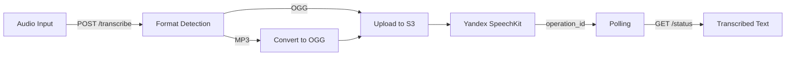

<div align="center">

#  STT Microservice

**Распознавание речи для AI-агентов: от голосового сообщения до текста за 60 секунд**

[](https://fastapi.tiangolo.com)
[](https://cloud.yandex.ru)
[](https://www.docker.com)
[](https://github.com/LizaKevbrina/stt-microservice)

*Обработка аудио до 4 часов • Автоконвертация форматов • Асинхронное распознавание*

[ Быстрый старт](#-быстрый-старт) • [ Use Cases](#-кому-это-нужно) • [ Интеграция](#-как-использовать)

</div>

---

##  Проблема

Голосовые каналы коммуникации теряют эффективность из-за:

-  **Невозможность обработки длинных аудио** — большинство API ограничены 30 секундами
-  **Разные форматы аудио** — MP3, OGG, WAV требуют ручной конвертации
-  **Медленная обработка** — пользователь ждет результата несколько минут
-  **Дорогие решения** — enterprise STT сервисы от $0.02/минута

---

##  Решение

Production-ready микросервис, который **преобразует голос в текст** для любых AI-систем:

```
 Аудиосообщение (до 4 часов) →  Автообработка →  Распознанный текст за 60 сек
```

### Как это работает

| Шаг | Что происходит | Результат |
|-----|----------------|-----------|
| 1️⃣ Загрузка | Пользователь отправляет аудио через API | Автоопределение формата |
| 2️⃣ Конвертация | MP3 → OGG (если нужно) | Оптимизация для STT |
| 3️⃣ Распознавание | Yandex SpeechKit обрабатывает | Асинхронно, до 4 часов аудио |
| 4️⃣ Результат | Получение текста через polling | 95%+ точность |

---

##  Результаты

<table>
<tr>
<td align="center" width="25%">
<h3>60 сек</h3>
<p>Среднее время обработки</p>
</td>
<td align="center" width="25%">
<h3>4 часа</h3>
<p>Максимальная длина аудио</p>
</td>
<td align="center" width="25%">
<h3>95%+</h3>
<p>Точность распознавания</p>
</td>
<td align="center" width="25%">
<h3>MP3/OGG</h3>
<p>Автоконвертация форматов</p>
</td>
</tr>
</table>

### Бизнес-эффект

- ✅ **Обработка длинных записей** — встречи, подкасты, лекции до 4 часов
- ✅ **Универсальность** — любой формат аудио конвертируется автоматически
- ✅ **Масштабируемость** — обработка сотен запросов параллельно
- ✅ **Низкая стоимость** — в 10 раз дешевле enterprise решений

---

##  Кому это нужно

<table>
<tr>
<td width="33%" valign="top">

###  Call-центры
**Проблема:** 1000+ звонков/день, вручную не расшифровать

**Решение:** Автоматическая транскрибация для анализа качества и обучения

</td>
<td width="33%" valign="top">

###  EdTech
**Проблема:** Лекции и вебинары недоступны в текстовом виде

**Решение:** Автоматические субтитры и поиск по контенту

</td>
<td width="33%" valign="top">

###  Медиа
**Проблема:** Подкасты/интервью требуют дорогой ручной расшифровки

**Решение:** Автотранскрибация с метками времени для публикации

</td>
</tr>
</table>

---

##  Как использовать

### Вариант 1: Как часть AI Sales Agent (главный проект)

Этот модуль используется в [ AI Sales Agent](https://github.com/LizaKevbrina/ai-agent-microservices) для обработки голосовых сообщений от клиентов.

**Workflow:** Telegram голосовое → STT → LLM → RAG → Ответ клиенту

```bash
# Уже включен в главный проект
cd ai-agent-microservices
make start  # STT сервис запустится автоматически
```

---

### Вариант 2: Standalone — для вашего проекта

Используйте как независимый микросервис для любого проекта, требующего STT:

**Шаг 1:** Клонируйте репозиторий
```bash
git clone https://github.com/LizaKevbrina/stt-microservice.git
cd stt-microservice
```

**Шаг 2:** Настройте `.env`
```bash
cp .env.example .env
nano .env  # Добавьте YANDEX_API_KEY, S3 credentials
```

**Шаг 3:** Запустите
```bash
docker-compose up -d
```

**Шаг 4:** Отправьте аудио
```bash
curl -X POST http://localhost:8000/api/v1/stt/transcribe \
  -F "audio_file=@voice.mp3" \
  -F "user_id=test" \
  -F "lang=ru-RU"
```

**Ответ:**
```json
{
  "success": true,
  "operation_id": "e03s6k9mj6qh********",
  "check_status_url": "/api/v1/stt/status/e03s6k9mj6qh********"
}
```

**Шаг 5:** Проверьте статус
```bash
curl http://localhost:8000/api/v1/stt/status/e03s6k9mj6qh********
```

**Результат:**
```json
{
  "done": true,
  "text": "Добрый день меня интересуют квартиры в новостройке...",
  "chunks_count": 15
}
```

---

##  Ключевые возможности

<table>
<tr>
<td width="50%">

###  Автоматизация
- Автоопределение формата аудио (MP3/OGG)
- Конвертация MP3 → OGG (Opus)
- Асинхронная обработка длинных файлов
- Retry-логика при сбоях

</td>
<td width="50%">

###  Production-ready
- Health checks для мониторинга
- Metrics API для аналитики
- S3-совместимое хранилище
- Swagger документация `/docs`

</td>
</tr>
</table>

---

##  Архитектура

### Упрощенная схема



### Компоненты

| Компонент | Назначение | Технология |
|-----------|-----------|------------|
| **FastAPI Service** | REST API для STT | Python 3.11, FastAPI |
| **Audio Processing** | Конвертация форматов | pydub, ffmpeg |
| **Object Storage** | Хранение аудиофайлов | S3-compatible (Yandex Cloud) |
| **STT Engine** | Распознавание речи | Yandex SpeechKit API |

<details>
<summary><b> Технические детали (для разработчиков)</b></summary>

### API Endpoints

| Endpoint | Method | Описание |
|----------|--------|----------|
| `/api/v1/stt/transcribe` | POST | Загрузка аудио, старт распознавания |
| `/api/v1/stt/status/{id}` | GET | Проверка статуса операции |
| `/api/v1/metrics` | GET | Метрики системы (запросы, ошибки, время) |
| `/api/v1/health` | GET | Health check |
| `/docs` | GET | Swagger UI документация |

### Обработка форматов

```python
# Автоопределение формата по magic bytes
if audio_data.startswith(b'ID3'):
    format = "MP3"
elif audio_data.startswith(b'OggS'):
    format = "OGG_OPUS"

# Конвертация MP3 → OGG (Opus)
audio = AudioSegment.from_file(BytesIO(audio_data), format="mp3")
audio = audio.set_channels(1)  # Mono
audio.export(ogg_buffer, format="ogg", codec="libopus")
```

### Асинхронный workflow

1. **Upload** — аудио в S3 (KMS encryption)
2. **Submit** — запрос в Yandex STT API
3. **Poll** — проверка статуса каждые 10 секунд
4. **Result** — извлечение текста из chunks

### Retry pattern

- До 20 попыток с exponential backoff
- Timeout: 30 секунд на запрос
- Graceful degradation при сбоях

</details>

---

##  Быстрый старт

### За 3 минуты

```bash
# 1. Клонируем
git clone https://github.com/LizaKevbrina/stt-microservice.git
cd stt-microservice

# 2. Настраиваем секреты
cp .env.example .env
# Заполните: YANDEX_API_KEY, S3_BUCKET_NAME, AWS_ACCESS_KEY_ID

# 3. Запускаем
docker-compose up -d

# 4. Проверяем
curl http://localhost:8000/api/v1/health
```

**Требования:**
- Docker & Docker Compose
- 2GB RAM, 1 vCPU
- API ключи: Yandex Cloud, S3-compatible storage

---

##  Технологии

**Backend:** FastAPI (Python 3.11), httpx, pydantic  
**Audio:** pydub, ffmpeg  
**Storage:** boto3 (S3-compatible)  
**AI:** Yandex SpeechKit (async STT)  
**Infrastructure:** Docker

<details>
<summary><b> Что демонстрирует проект (для техлидов)</b></summary>

### Backend Engineering
✅ RESTful API с версионированием  
✅ Async/await для non-blocking I/O  
✅ Multipart form-data handling  
✅ Background tasks (FastAPI BackgroundTasks)  
✅ Structured logging  
✅ Error handling & retry patterns

### Infrastructure
✅ Docker containerization  
✅ S3 integration (boto3)  
✅ Health checks & metrics  
✅ Production-ready deployment  
✅ Secrets management (.env)

### Audio Processing
✅ Format detection (magic bytes)  
✅ MP3 → OGG conversion (pydub)  
✅ Streaming file upload  
✅ Large file handling (up to 4 hours)

### External API Integration
✅ Yandex SpeechKit async API  
✅ Long-polling pattern  
✅ Operation status tracking  
✅ Timeout & retry logic

</details>

---

##  Производительность

| Метрика | Значение |
|---------|----------|
| **Время обработки** | 30-90 сек (зависит от длины аудио) |
| **Макс. длина аудио** | 4 часа |
| **Поддерживаемые форматы** | MP3, OGG, WAV (автоконвертация) |
| **Точность** | 95%+ (русский язык) |
| **Параллельные запросы** | до 10 одновременно |
| **Стоимость** | ~$0.002/минута (Yandex Cloud) |

---

##  Примеры интеграции

### Пример 1: Telegram бот

```python
from telegram import Update
from telegram.ext import MessageHandler, filters
import httpx

async def handle_voice(update: Update, context):
    # Скачиваем голосовое сообщение
    voice = await update.message.voice.get_file()
    voice_bytes = await voice.download_as_bytearray()
    
    # Отправляем в STT сервис
    async with httpx.AsyncClient() as client:
        response = await client.post(
            "http://stt-service:8000/api/v1/stt/transcribe",
            files={"audio_file": voice_bytes},
            data={"user_id": str(update.message.from_user.id)}
        )
    
    operation_id = response.json()["operation_id"]
    await update.message.reply_text("Обрабатываю аудио...")
    
    # Polling статуса
    while True:
        status = await client.get(f"http://stt-service:8000/api/v1/stt/status/{operation_id}")
        data = status.json()
        if data["done"]:
            await update.message.reply_text(f"Текст: {data['text']}")
            break
        await asyncio.sleep(5)
```

### Пример 2: Добавление в существующий FastAPI проект

```python
# Ваш main.py
from fastapi import FastAPI, UploadFile
import httpx

app = FastAPI()

@app.post("/process-audio")
async def process_audio(audio: UploadFile):
    # Отправляем в STT микросервис
    async with httpx.AsyncClient() as client:
        response = await client.post(
            "http://stt-service:8000/api/v1/stt/transcribe",
            files={"audio_file": await audio.read()},
            data={"user_id": "app_user"}
        )
    
    # Используем результат
    return response.json()
```

### Пример 3: n8n workflow

```json
{
  "nodes": [
    {
      "name": "HTTP Request - STT",
      "type": "n8n-nodes-base.httpRequest",
      "parameters": {
        "url": "http://stt-service:8000/api/v1/stt/transcribe",
        "method": "POST",
        "bodyParameters": {
          "parameters": [
            {"name": "audio_file", "value": "={{$binary.data}}"},
            {"name": "user_id", "value": "={{$json.userId}}"}
          ]
        }
      }
    }
  ]
}
```

---

##  Экосистема проектов

Этот микросервис — **модульный компонент**, который можно использовать отдельно или как часть AI-агента:

| Проект | Описание | Связь |
|--------|----------|-------|
| **[ AI Sales Agent](https://github.com/LizaKevbrina/ai-agent-microservices)** | Главный проект — голосовой ассистент для продаж | Использует STT для обработки голосовых сообщений |
| **STT Microservice** (этот репозиторий) | Распознавание речи до 4 часов | Standalone модуль для любых проектов |
| **[ RAG Knowledge Sync](https://github.com/LizaKevbrina/rag-knowledge-sync)** | Автосинхронизация базы знаний | Используется в главном проекте |

---

##  Part of AI Agent Platform

Этот сервис является частью экосистемы [ AI Sales Agent](https://github.com/LizaKevbrina/ai-agent-microservices) — production-ready AI-агента для автоматизации продаж в недвижимости.

### Как используется в главном проекте

**Workflow:** Клиент отправляет голосовое сообщение в Telegram → n8n workflow → **STT Microservice** распознает речь → LLM генерирует ответ → RAG добавляет контекст из базы знаний → Ответ клиенту

**Интеграция:**
```yaml
# docker-compose.yml главного проекта
services:
  stt-service:
    image: ghcr.io/lizakevbrina/stt-microservice:latest
    environment:
      - YANDEX_API_KEY=${YANDEX_API_KEY}
    ports:
      - "8002:8000"
```

### Standalone использование

Вы можете использовать STT Microservice **независимо** для:
-  Транскрибации call-центров
-  Обработки подкастов и интервью
-  Создания субтитров для EdTech платформ
-  Любых AI-агентов, требующих обработку голоса

**См. также:**
- [ RAG Knowledge Sync](https://github.com/LizaKevbrina/rag-knowledge-sync) — автообновление базы знаний
- [ AI Sales Agent](https://github.com/LizaKevbrina/ai-agent-microservices) — главный проект

---

##  Лицензия

MIT License — см. [LICENSE](LICENSE)

---

<div align="center">

## 👩‍💻 Автор

**Елизавета Кевбрина**

*LLM Engineer • Workflow Automation • AI Integrations*

[](mailto:elisa.kevbrina@yandex.ru)
[](https://github.com/LizaKevbrina)

---

**⭐ Если проект полезен, поставьте звезду!**

*Made with ❤️ for AI community*

</div>
